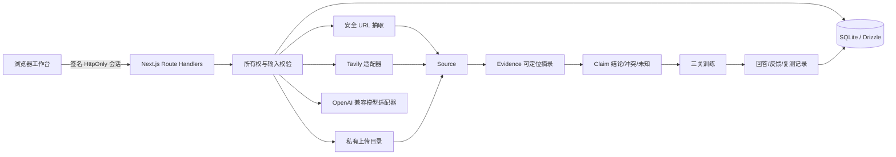

# 架构说明

## 运行形态

单个长驻 Node 进程同时承载 Next.js App Router、Route Handlers、模型/搜索适配器与本地 SQLite。Docker 只需要一个持久化数据卷，不引入 Redis、向量库、Python 微服务或后台多智能体。

## 核心表

| 表 | 责任 | 所有权键 |
|---|---|---|
| `workspaces` | 会话隔离与 demo/real 模式 | `session_id` |
| `targets` | 学校、院系、项目、学位、批次、年份、导师 | `workspace_id` |
| `sources` | URL/上传定位、作者、日期、适用范围、哈希、转载与权限 | `workspace_id` |
| `evidences` | 精确摘录、位置、定位状态、是否仅摘要 | `workspace_id` |
| `claims` | 事实/经验/推理/未知、证据 ID、核实与冲突 | `workspace_id` |
| `research_tasks` | plan → discover → fetch → extract → verify → synthesize → ready/partial/failed | `workspace_id` |
| `training_records` | 机试/面试/项目回答、结果类型、反馈与复测链 | `workspace_id` |
| `attachments` | 私有文件位置、提取文本与解析状态 | `workspace_id` |

## 真值与证据规则

1. 搜索摘要只能发现线索；只有读取到的原文或用户有权提供的材料可形成可定位 Evidence。
2. Claim 引用已存在的 Evidence ID；机械校验验证引用存在、来源存在和精确摘录可定位。
3. 语义核实与机械校验分离；`verified`、`needs_review`、`unknown` 不因“可定位”自动升级。
4. 旧年份与其他批次保留自身 scope；训练推荐可以参考，但不能转写为当前规则。
5. 转载通过 `reprint_of` 与内容哈希去重；冲突以 ID 关系并列保留。
6. 训练题显式区分 `official_past`、`official_sample`、`recalled_past`、`recommended_practice` 和 `generated`。
7. `self_reported`、`ai_review`、`sandbox_judged` 是互斥结果来源；本版本不产生 `sandbox_judged`。

## 信任边界

- 外部网页和上传内容永远作为不可信资料，不作为系统指令，也不进入工具调用参数。
- `LLM_API_KEY`、`TAVILY_API_KEY` 与数据库路径只在服务端读取；浏览器仅提交访问码。
- URL 导入逐跳校验 http/https、主机名、DNS 解析与重定向，拒绝环回、私网、链路本地和元数据地址。
- 上传最大 5 MB，只接受 PDF/TXT/Markdown；扫描件不足 80 字时返回 `needs_text`。
- 删除 API 从已验证会话反查工作区，并再次校验附件绝对路径位于上传根目录内。

## 中断与容量

研究任务在同步 Route Handler 内完成，状态写入 SQLite；进程异常重启后，调用方应将遗留的非终态任务视为 `interrupted`。默认预算为 10 次搜索、20 个抽取页面；适配器还设置 10–30 秒超时和小规模结果上限。单实例部署避免 SQLite 多写者争用。
