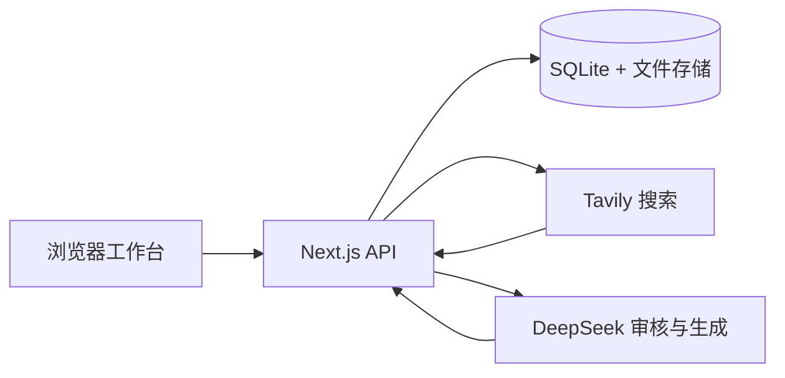

<div align="center">


[](./LICENSE)

# 🎓 循证保研

**把院校信息、往年经验和个人材料，整理成可追溯的三关准备题单**

[🌐 在线体验](https://baoyan-prep-production.up.railway.app) · [✨ 功能特性](#-功能特性) · [🧭 使用流程](#-使用流程) · [🧰 技术栈](#-技术栈) · [🚀 本地启动](#-本地启动) · [📁 项目结构](#-项目结构)

</div>

---

## 📖 简介

循证保研是一个面向计算机相关保研考核的项目化准备工作台。每所学校拥有独立的申请目标、资料库和题单版本；系统先收集、去重并审核公开资料，再生成机试、专业面试和简历项目追问。

它强调“题目从哪里来”：有依据的题目可以查看来源、摘录与原链接，证据不足的内容会明确标记为通用补充或 AI 生成，不把模型猜测包装成往年真题。

### 核心场景

| 关卡 | 你会得到什么 |
|---|---|
| `</>` **机试** | 根据目标院校资料生成套卷或单题练习，保留原题链接、题源分类和 C++ / Python / Java 草稿编辑器 |
| `▣` **面试题单** | 按高频主题整理专业基础、数学、科研潜力、英语问答与综合素质问题，只输出问题，不生成标准答案 |
| `⌕` **项目追问** | 将当前简历与导师或课题组公开研究方向映射，生成最可能被追问的项目问题 |

## ✨ 功能特性

- 🗂️ **学校项目工作台** — ChatGPT 式侧栏切换项目，支持置顶、删除和多个精细申请目标。
- 🔎 **联网资料库** — 使用 Tavily 收集公开招生信息、机试与面试经验；也可导入 URL、文本、PDF 和图片。
- 🧠 **两阶段资料筛选** — 规则层完成 URL 规范化、去重和基础评分，再交给 DeepSeek 做目标相关性、证据等级与适用关卡复核。
- 🧾 **可追溯题单** — 题目区分官方真题/样题、回忆题、证据推断、通用补充和 AI 生成，证据通过抽屉按需查看。
- 🧑‍💻 **机试练习与复盘** — 支持三种语言草稿与一次性 AI 静态复盘；不在服务端执行代码，也不冒充真实判题。
- 📄 **简历定向追问** — 上传 PDF 或粘贴简历文本，选择单个导师或整个课题组后生成针对性问题。
- 🕓 **只读版本管理** — 三关生成结果保留时间与来源快照，支持版本切换、删除和浏览器 PDF 导出。
- 🔐 **本地优先密钥** — DeepSeek 与 Tavily Key 可只保存在当前浏览器，随请求发送给后端，不写入数据库或导出文件。

## 🧭 使用流程

```text
创建学校项目 → 确认申请目标 → 联网收集 / 上传资料
              ↓
       规则预筛 + DeepSeek 语义复核
              ↓
        生成三关题单 → 核查证据 → 导出 PDF
```

1. 在左侧创建学校项目，并填写院系、专业/项目、年份、批次和研究方向。
2. 打开“项目资料”，选择快速、标准或深度档位后开始联网收集，也可以加入自己的材料。
3. 进入机试、面试题单或项目追问，生成当前申请目标的只读题单。
4. 点击题目证据查看来源；必要时返回资料库补充材料后重新生成新版本。

## 🔬 来源与证据策略

题源优先级为：

1. 官方招生说明、考试大纲、真题或样题；
2. 可靠的往年回忆与经验材料；
3. 同校、同院系或同考纲的相似材料；
4. 通用知识点补充；
5. 明确标注的 AI 生成内容。

网络资料保留原始链接、提取文本、抓取时间、可信度和适用目标。受登录、验证码或访问权限限制的内容不会被绕过，可由用户自行上传或粘贴。重复资料按规范化 URL 与内容指纹合并。

## 🌐 在线体验

公开演示地址：**[baoyan-prep-production.up.railway.app](https://baoyan-prep-production.up.railway.app)**

在线版本可以直接浏览产品流程。使用真实联网收集和题单生成时，请在右上角 **API Key** 弹窗中填写自己的 DeepSeek 与 Tavily Key；密钥仅保存在当前浏览器的 `localStorage`。这是个人工具的首版部署，不包含账号、多用户隔离和云同步。

## 🧰 技术栈

| 层级 | 方案 |
|---|---|
| Web | Next.js 16、React 19、TypeScript、Tailwind CSS 4 |
| 数据 | SQLite、Drizzle ORM、本地文件存储 |
| 模型 | DeepSeek Flash / Pro，结构化 JSON Schema 输出 |
| 搜索 | Tavily Search API、公开页面正文提取 |
| 文件 | PDF / 图片上传、`unpdf` 文本提取、ZIP 批量导出 |
| 测试 | Vitest、Testing Library、Playwright |
| 部署 | Docker、Railway 持久卷、健康检查 |



## 🚀 本地启动

要求 Node.js 22+ 与 pnpm 11+。

```bash
corepack enable
pnpm install --frozen-lockfile
cp .env.example .env.local
pnpm db:migrate
pnpm dev
```

Windows PowerShell：

```powershell
corepack enable
pnpm install --frozen-lockfile
Copy-Item .env.example .env.local
pnpm db:migrate
pnpm dev
```

打开 <http://localhost:3000>。默认 `DEMO_MODE=true`；真实联网研究与生成需要在页面中配置密钥，或使用服务端环境变量。

### 环境变量

```dotenv
DEMO_MODE=false
SESSION_SECRET=<至少 32 字节的随机字符串>
APP_ACCESS_CODE=<可选：保护公网额度入口的访问码>
LLM_BASE_URL=https://api.deepseek.com
LLM_API_KEY=<DeepSeek 服务端密钥>
LLM_MODEL=deepseek-flash
TAVILY_API_KEY=<Tavily 服务端密钥>
DATABASE_URL=./data/baoyan-prep.db
UPLOAD_DIR=./data/uploads
```

页面填写的密钥不会写入数据库、日志或导出文件。公网环境建议使用独立测试额度，并配置 HTTPS、访问保护、请求大小限制和持久卷备份。

## 📁 项目结构

```text
baoyan-prep/
├─ src/
│  ├─ app/                 # 页面与 Route Handlers
│  ├─ components/          # 工作台、资料库、三关页面与通用组件
│  └─ lib/                 # 数据库、搜索、筛选、模型、文件与安全逻辑
├─ drizzle/                # 增量数据库迁移
├─ e2e/                    # Playwright 研究流程测试
├─ public/                 # 静态资源
├─ data/                   # 本地数据库与上传目录（不会提交）
├─ Dockerfile
├─ docker-compose.yml
└─ railway.toml
```

## ✅ 质量状态

| 检查 | 当前结果 |
|---|---|
| TypeScript | 通过 |
| ESLint | 通过 |
| Vitest | 9 个文件，51/51 通过 |
| Playwright 研究流程 | 4/4 通过 |
| 生产构建 | 通过 |
| Railway 健康检查 | `/api/health` 返回 `ok: true` |

```bash
pnpm typecheck
pnpm lint
pnpm test
pnpm build
pnpm test:e2e
```

更完整的检查记录见 [EVALUATION.md](./EVALUATION.md)。

## 🐳 Docker 部署

```bash
docker compose up --build -d
```

Compose 将 `/app/data` 挂载到命名卷 `baoyan-data`，并通过 `/api/health` 检查 SQLite。当前数据层按单实例 Node 服务设计；不要把 SQLite 数据目录放在没有持久磁盘保证的无服务器环境中。

## ⚠️ 当前边界

- 不在应用服务器执行用户代码；代码复盘只做一次性静态分析。
- 联网研究目前是单任务流式执行，尚未引入跨进程队列和自动周期采集。
- 复杂 JavaScript 页面、低清扫描件和受限页面可能只能提取部分内容。
- 当前适合个人或单实例部署，不实现账号、多用户、云同步、标准答案和学习进度。
- 已完成真实 DeepSeek 结构化审核验证；完整真实 Tavily 搜索仍需要部署者提供有效 Key 后验收。

## 📚 文档

- [ARCHITECTURE.md](./ARCHITECTURE.md) — 架构、数据模型与信任边界
- [DATA_SOURCES.md](./DATA_SOURCES.md) — 来源策略与真实适配器
- [EVALUATION.md](./EVALUATION.md) — 已运行检查、结果与限制
- [THIRD_PARTY_NOTICES.md](./THIRD_PARTY_NOTICES.md) — 设计参考与第三方许可

## 🙏 参考与许可

工作台的信息组织与 README 呈现参考了 [zmy15/interview-agent](https://github.com/zmy15/interview-agent)；相关说明见 [THIRD_PARTY_NOTICES.md](./THIRD_PARTY_NOTICES.md)。

原创代码按 [Apache-2.0](./LICENSE) 许可发布。公开的是代码，不是用户数据。
