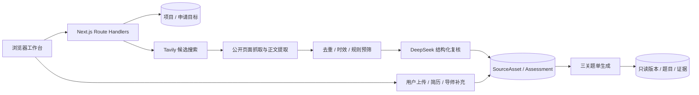

# 当前版本架构说明

## 核心链路

## 数据隔离

- `PrepProject` 是学校级项目；北京大学和清华大学的资料、题单和研究任务不会混用。
- `ApplicationTarget` 保存院系、专业、方向、年份、批次和导师，一个学校项目可有多个申请目标。
- `SourceAsset` 区分自动采集和用户上传，保留原链接、提取文本、状态、可信度和内容指纹。
- `SourceAssessment` 保存模型复核结果，包括目标匹配、质量分、证据等级、适用关卡和理由。
- `QuestionSetVersion`、`QuestionItem` 和证据关系保存三关的只读历史版本。
- `ResumeAsset` 是当前工作区唯一简历；`FacultySubject` 保存单导师或课题组上下文。

## 资料筛选策略

1. Tavily 只负责发现候选来源，不把搜索摘要直接视为可靠事实。
2. 服务端读取公开页面正文，拒绝私网、环回、元数据地址和危险重定向。
3. 规范化 URL 与内容哈希合并重复来源。
4. 规则预筛处理空内容、明显无关项、低信息量和时效范围。
5. DeepSeek 使用严格 JSON Schema 复核目标匹配、证据等级和适用关卡；只读取最终 `output_text`。
6. 生成题单时优先使用官方真题/样题、可靠回忆和证据推断；不足部分明确标为 AI 补充。

## 安全与部署边界

- DeepSeek/Tavily 密钥不写入 SQLite、日志、导出文件或 Git。
- 上传目录和 SQLite 数据库均被 `.gitignore` 排除。
- 首版不执行用户代码，不声称 AI 复盘等于真实 OJ 判题。
- 单机 SQLite 需要持久磁盘；公网部署应使用长驻 Node 服务或可挂载持久卷的平台。
